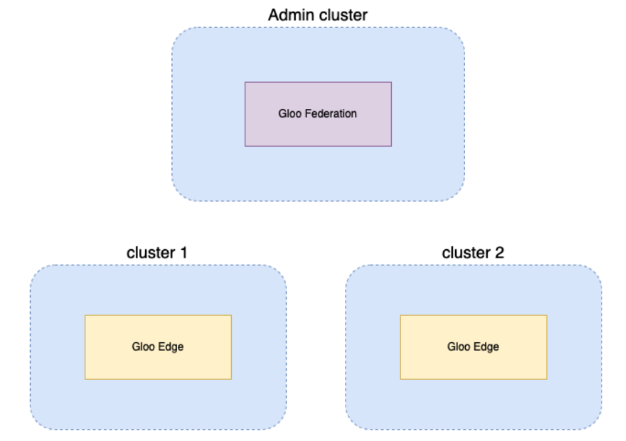

## Gloo Edge Federation (dedicated admin cluster) on GKE clusters and Manual Registration



Install glooctl:
```sh
curl -sL https://run.solo.io/gloo/install | sh
export PATH=$HOME/.gloo/bin:$PATH
```

Create 3 GKE clusters:
```sh
export PROJECT_ID=customer-success-386314
export REGION=us-west1
export ZONE1=us-west1-a
export ZONE2=us-west1-b
export ZONE3=us-west1-c
export VPC_NAME=glau-solo-vpc
export SUBNET_NAME=glau-solo-vpc-subnet1
export MGMT_CLUSTER=glau-solo-mgmt-cluster
export CLUSTER1=glau-solo-cluster1
export CLUSTER2=glau-solo-cluster2

gcloud compute networks create $VPC_NAME \
    --subnet-mode=custom \
    --bgp-routing-mode=regional

gcloud compute networks subnets create $SUBNET_NAME \
    --network=$VPC_NAME \
    --region=$REGION \
    --range=10.0.1.0/24

gcloud container clusters create $MGMT_CLUSTER \
  --zone=$ZONE1 --num-nodes=1 \
  --image-type=COS_CONTAINERD \
  --machine-type=e2-standard-4 \
  --network=$VPC_NAME \
  --subnetwork=$SUBNET_NAME \
  --enable-ip-alias \
  --logging=SYSTEM,WORKLOAD \
  --labels=created-by=gilbert_lau,team=customer-success,purpose=poc

gcloud container clusters create $CLUSTER1 \
  --zone=$ZONE2 --num-nodes=1 \
  --image-type=COS_CONTAINERD \
  --machine-type=e2-standard-4 \
  --network=$VPC_NAME \
  --subnetwork=$SUBNET_NAME \
  --enable-ip-alias \
  --logging=SYSTEM,WORKLOAD \
  --labels=created-by=gilbert_lau,team=customer-success,purpose=poc

gcloud container clusters create $CLUSTER2 \
  --zone=$ZONE3 --num-nodes=1 \
  --image-type=COS_CONTAINERD \
  --machine-type=e2-standard-4 \
  --network=$VPC_NAME \
  --subnetwork=$SUBNET_NAME \
  --enable-ip-alias \
  --logging=SYSTEM,WORKLOAD \
  --labels=created-by=gilbert_lau,team=customer-success,purpose=poc
```

Grab GKE cluster contexts:
```sh
gcloud container clusters get-credentials $MGMT_CLUSTER --zone $ZONE1 --project $PROJECT_ID
export MGMT_CONTEXT=$(kubectl config current-context)

gcloud container clusters get-credentials $CLUSTER1 --zone $ZONE2 --project $PROJECT_ID
export CLUSTER1_CONTEXT=$(kubectl config current-context)

gcloud container clusters get-credentials $CLUSTER2 --zone $ZONE3 --project $PROJECT_ID
export CLUSTER2_CONTEXT=$(kubectl config current-context)
```

View clusters:
```
kubectl get nodes --context $MGMT_CONTEXT
kubectl get nodes --context $CLUSTER1_CONTEXT
kubectl get nodes --context $CLUSTER2_CONTEXT
```

Install Gloo Gateway Federation on the management cluster:
```sh
export GLOO_VERSION=1.17.0-rc5
```

```sh
helm repo add gloo-fed https://storage.googleapis.com/gloo-fed-helm
helm repo update
```
```sh
helm install gloo-fed gloo-fed/gloo-fed --version $GLOO_VERSION --set license_key=$GLOO_LICENSE_KEY -n gloo-system --create-namespace --kube-context $MGMT_CONTEXT
```
View status:
```sh
kubectl get all -n gloo-system --context $MGMT_CONTEXT
```

Install Gloo Gateway Enterprise on the workload clusters:
```sh
helm repo add glooe https://storage.googleapis.com/gloo-ee-helm
```
```sh
helm install gloo glooe/gloo-ee --namespace gloo-system \
  --create-namespace --set-string license_key=$GLOO_LICENSE_KEY \
  --version $GLOO_VERSION --kube-context $CLUSTER1_CONTEXT

helm install gloo glooe/gloo-ee --namespace gloo-system \
  --create-namespace --set-string license_key=$GLOO_LICENSE_KEY \
  --version $GLOO_VERSION --kube-context $CLUSTER2_CONTEXT
```

Manual Registration of workload clusters:
```sh
clusters=("$CLUSTER1:$CLUSTER1_CONTEXT" "$CLUSTER2:$CLUSTER2_CONTEXT") 
for element in "${clusters[@]}"; do
  
  cluster_name=${element%%:*}
  cluster_context=${element##*:}
  kubectl --context $cluster_context -n gloo-system create sa $cluster_name
  token=$(kubectl create token $cluster_name -n gloo-system --context $cluster_context)
  kubectl create secret generic $cluster_name -n gloo-system --context $cluster_context --from-literal=token="$token"

  kubectl --context $cluster_context -n gloo-system apply -f - <<EOF
apiVersion: rbac.authorization.k8s.io/v1
kind: ClusterRole
metadata:
  name: gloo-federation-controller
rules:
- apiGroups:
  - gloo.solo.io
  - gateway.solo.io
  - enterprise.gloo.solo.io
  - ratelimit.solo.io
  - graphql.gloo.solo.io
  resources:
  - '*'
  verbs:
  - '*'
- apiGroups:
  - apps
  resources:
  - deployments
  - daemonsets
  verbs:
  - get
  - list
  - watch
- apiGroups:
  - ""
  resources:
  - pods
  - nodes
  - services
  verbs:
  - get
  - list
  - watch
---
apiVersion: rbac.authorization.k8s.io/v1
kind: ClusterRoleBinding
metadata:
  name: ${cluster_name}-gloo-federation-controller-clusterrole-binding
roleRef:
  apiGroup: rbac.authorization.k8s.io
  kind: ClusterRole
  name: gloo-federation-controller
subjects:
- kind: ServiceAccount
  name: $cluster_name
  namespace: gloo-system
EOF

  cat > kc-${cluster_name}.yaml <<EOF1
apiVersion: v1
clusters:
- cluster:
    certificate-authority-data: $(eval kubectl config view --raw | yq ".clusters[] | select(.name == \"$cluster_context\") | .cluster.\"certificate-authority-data\"")
    server: $(eval kubectl config view --raw | yq ".clusters[] | select(.name == \"$cluster_context\") | .cluster.server")
  name: $cluster_context
contexts:
- context: 
    cluster: $cluster_context
    user: $cluster_context
  name: $cluster_context
current-context: $cluster_context
kind: Config
preferences: {}
users:
- name: $cluster_context
  user:
    token: $token
EOF1
  
  cluster_env_name=$(echo $cluster_name | tr '-' '_')
  export kc_${cluster_env_name}=$(cat kc-${cluster_name}.yaml | base64)
  kubectl --context $MGMT_CONTEXT apply -f - <<EOF2
---
apiVersion: multicluster.solo.io/v1alpha1
kind: KubernetesCluster
metadata:
  name: $cluster_name
  namespace: gloo-system
spec:
  clusterDomain: cluster.local
  secretName: $cluster_name
---
apiVersion: v1
kind: Secret
metadata:
  name: $cluster_name
  namespace: gloo-system
type: solo.io/kubeconfig
data:
  kubeconfig: $(eval "echo \${kc_${cluster_env_name}}") 
EOF2
done
```

Verify discovered Gloo Gateway instances:
```sh
kubectl get glooinstances -n gloo-system --context $MGMT_CONTEXT
```

Deploy a sample app:
```sh
kubectl create ns httpbin --context $CLUSTER1_CONTEXT
kubectl -n httpbin apply -f https://raw.githubusercontent.com/solo-io/gloo-mesh-use-cases/main/policy-demo/httpbin.yaml --context $CLUSTER1_CONTEXT
kubectl apply -f ./data/upstream.yaml --context $CLUSTER1_CONTEXT
kubectl apply -f ./data/authconfig.yaml --context $CLUSTER1_CONTEXT
kubectl apply -f ./data/virtualservice.yaml --context $CLUSTER1_CONTEXT
kubectl apply -f ./data/routetable-parent.yaml --context $CLUSTER1_CONTEXT
kubectl apply -f ./data/routetable-child.yaml --context $CLUSTER1_CONTEXT
```

View Read-only Console:
```sh
kubectl port-forward svc/gloo-fed-console -n gloo-system 8090:8090 --context $MGMT_CONTEXT
```
```
http://localhost:8090
```

Tear down the environment:
```sh
gcloud container clusters delete $MGMT_CLUSTER --zone $ZONE1 --quiet 
gcloud container clusters delete $CLUSTER1 --zone $ZONE2 --quiet
gcloud container clusters delete $CLUSTER2 --zone $ZONE3 --quiet
gcloud compute networks subnets delete $SUBNET_NAME --region=$REGION --quiet
gcloud compute networks delete $VPC_NAME --quiet
```

